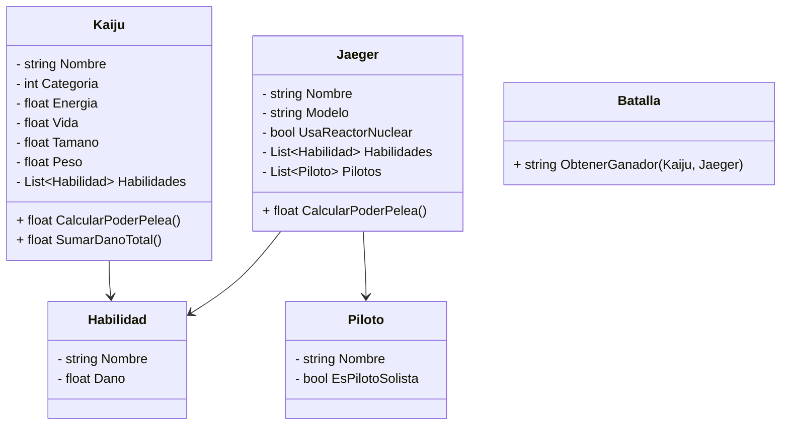

<h1 align="center"> E.T. Nº12 D.E. 1º "Libertador Gral. José de San Martín" </h1>
<p align="center">
  
</p>

# Computación : 2025

**Asignatura**: Desarrollo de Sistemas

**Nombre TP**: Titanes del Pacifico

**Apellido y Nombre Alumno**: Josu Guzman

**Curso**: 5 ° 7

# 🌊 Titanes del Pacífico - Simulador de Batallas Kaiju vs Jaegers

**Trabajo Práctico de Programación Orientada a Objetos (TP1) - ET°12 N°1**

Este proyecto simula el universo de *Titanes del Pacífico* (Pacific Rim), con clases que representan a los colosales Kaijus y los poderosos Jaegers. Permite calcular su poder de pelea, listar habilidades y simular combates épicos con una estructura clara y orientada a objetos en C#.

## 🚀 Características

- Modelo de clases para Kaijus, Jaegers, Habilidades y Pilotos.
- Cálculo del poder de pelea según reglas del universo de la saga.
- Lógica de batalla entre un Kaiju y un Jaeger.
- Consola informativa con resultados detallados.

## 🧱 Estructura de Clases

- `Kaiju`: Monstruo interdimensional con energía, vida, habilidades y categoría.
- `Jaeger`: Robot gigante tripulado por humanos, con armas y tipo de tecnología.
- `Habilidad`: Poder ofensivo de Kaiju o Jaeger.
- `Piloto`: Humano que opera el Jaeger.
- `Batalla`: Lógica que determina el ganador.

## 📦 Requisitos

- .NET 6.0 o superior
- Visual Studio / VSCode / Rider

## ▶️ Ejecución

Compilá y ejecutá el proyecto para ver el resultado de una batalla entre el Jaeger **Gipsy Danger** y el Kaiju **Knifehead**.

```bash
dotnet run
```

# Diagrama de Clases del Proyecto


