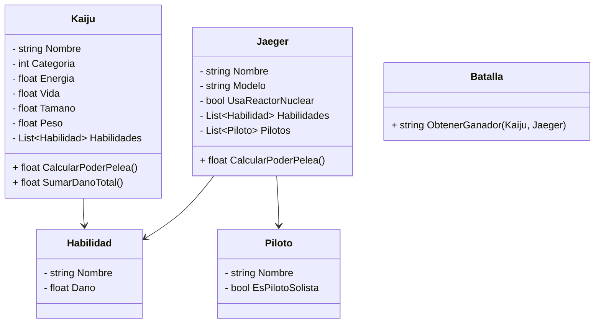

<h1 align="center"> E.T. Nº12 D.E. 1º "Libertador Gral. José de San Martín" </h1>

  

# Computación : 2025

**Asignatura**: Desarrollo de Sistemas

**Nombre TP**: Titanes del Pacifico

**Apellido y Nombre Alumno**: Josu Duran

**Curso**: 5 ° 7

# Diagrama de Clases del Proyecto

